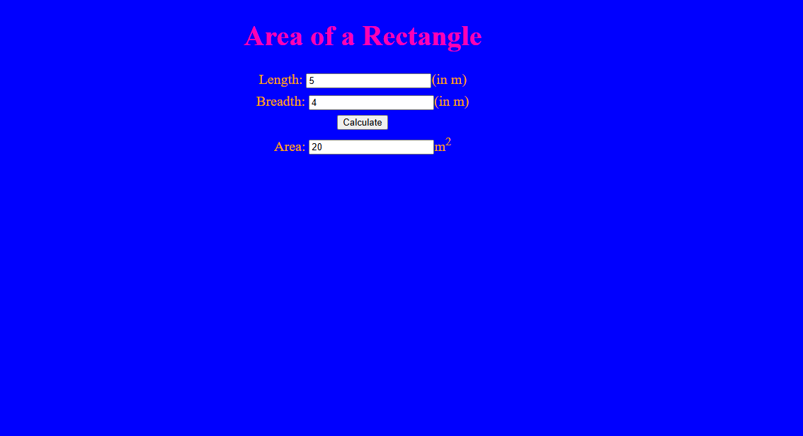

# Ex.05 Design a Website for Server Side Processing
## Date:

## AIM:
 To design a website to calculate the power of a lamp filament in an incandescent bulb in the server side. 


## FORMULA:
P = I<sup>2</sup>R
<br> P --> Power (in watts)
<br> I --> Intensity
<br> R --> Resistance

## DESIGN STEPS:

### Step 1:
Clone the repository from GitHub.

### Step 2:
Create Django Admin project.

### Step 3:
Create a New App under the Django Admin project.

### Step 4:
Create python programs for views and urls to perform server side processing.

### Step 5:
Create a HTML file to implement form based input and output.

### Step 6:
Publish the website in the given URL.

## PROGRAM :

```
side.html

<style>
body{
    font-size: 20px;
background-color:blue;
}
.formelt{
color:orange;
text-align: center;
margin-top: 7px;
margin-bottom: 6px;
}
h1
{
color:rgb(255, 0, 179);
text-align: center;
padding-top: 20px;
}
</style>
</head>
<body>
<div class="edge">
<div class="box">
<h1>Area of a Rectangle</h1>
<form method="POST">

<div class="formelt">
Length: <input type="text" name="length" value="{{l}}"></input>(in m)<br/>
</div>
<div class="formelt">
Breadth: <input type="text" name="breadth" value="{{b}}"></input>(in m)<br/>
</div>
<div class="formelt">
<input type="submit" value="Calculate"></input><br/>
</div>
<div class="formelt">
Area: <input type="text" name="area" value="{{area}}"></input>m<sup>2</sup><br/>
</div>
</form>
</div>
</div>
</body>
</html>

views.py

from django.shortcuts import render
def rectarea (request):
    context={}
    context['area'] = "0"
    context['l'] = "0"
    context['b'] = "0"
    if request.method == 'POST':
      print("POST method is used")
      l= request.POST.get('length', '0')
      b = request.POST.get('breadth', '0')
      print('request=', request)
      print('Length=',l)
      print('Breadth=',b)
      area = int(l) * int(b)
      context['area'] = area
      context['l'] = l
      context['b'] = b
      print('Area=', area)
    return render(request, 'sideapp/side.html',context)

urls.py

from django.contrib import admin
from django.urls import path
from sideapp import views
urlpatterns = [
    path('admin/', admin.site.urls),
    path('areaofrectangle/', views.rectarea, name="areaofrectangle"),
    path('',views.rectarea,name="areaofrectangleroot")
]

```

## SERVER SIDE PROCESSING:


## HOMEPAGE:



## RESULT:
The program for performing server side processing is completed successfully.
